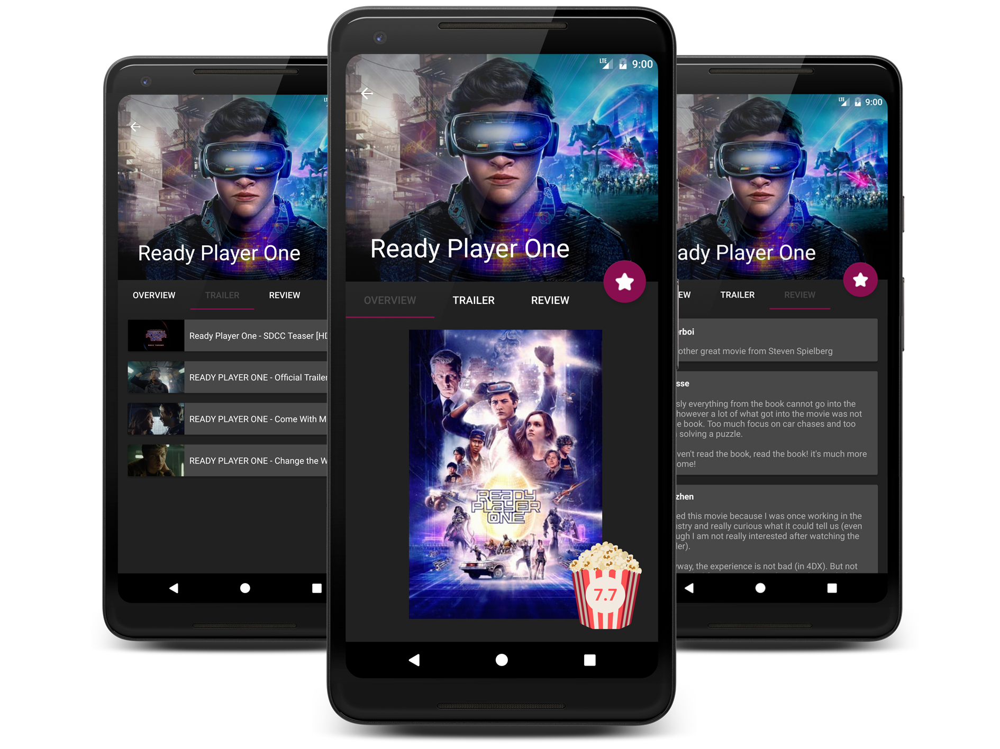
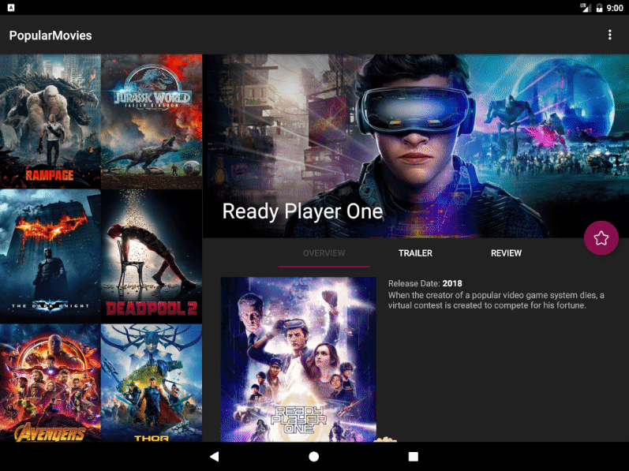

# PopularMovies
*Udacity’s Android Developer Nanodegree project* <br/>

This Android app allows users to discover the most popular and top rated movies. Users can check movie details, watch 
trailers and teasers, read other people's reviews. Users can mark as favorite any movie for easy access in the future 
even offline. UI contains a settings menu to toggle the sort order of the movies.


## Feature

- App uses database to store the user's favorite movies
- App uses Fragments to create a responsive design that works on phones and tablets
- App utilizes a third-party library to enhance the app's features
- App uses themoviedb.org API


## Libraries

- Gson
- Picasso
- ButterKnife


## How to run

The app uses [The Movie Database](https://www.themoviedb.org/documentation/api) API to get movie information and posters. You must provide your own API key in order to build the app.
Just put your API key into ~/.gradle/gradle.properties file (create the file if it does not exist):
```
MovieDbApiKey="your-api-key-here"
```

## Screenshots
<br/>

<br/>

<br/>
<p align="center">
  
</p>
<br/>
<br/>
<br/> 
<p align="center">
  
</p>
<br/>

## License

    Copyright 2018 Attila Kasza

    Licensed under the Apache License, Version 2.0 (the "License");
    you may not use this file except in compliance with the License.
    You may obtain a copy of the License at

        http://www.apache.org/licenses/LICENSE-2.0

    Unless required by applicable law or agreed to in writing, software
    distributed under the License is distributed on an "AS IS" BASIS,
    WITHOUT WARRANTIES OR CONDITIONS OF ANY KIND, either express or implied.
    See the License for the specific language governing permissions and
    limitations under the License.
